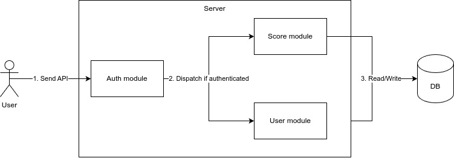
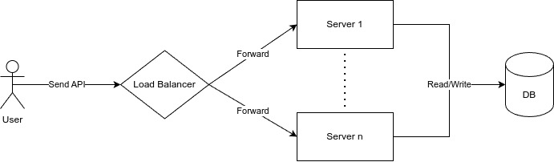
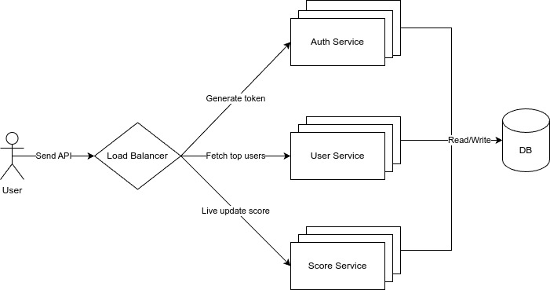
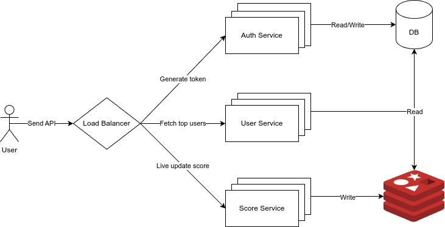

# 1. Analysis

- Shows the top 10 user’s scores &#8594; `GET /api/users/top`
- Live update score &#8594; `PUT /api/users/:user_id/score`
- Prevent malicious users &#8594; `Authentication`

# 2. High level design

## 2.1. Basic design



- We start with a simple design:
  - Auth module to verify if user is authenticated or not
  - Score module to live update score
  - User module to get top 10 user
- Props:
  - Simple
  - Easy to implement
- Cons:
  - Can not scale when traffic increase

## 2.2. Multiple instances

- To solve cons of the first design we can scale horizontally by increasing the number of servers and add load balancer.



- Pros:
  - Easy to scale when the traffic increase
- Cons:
  - Not efficient when a operation (read/write) is very high. It may slow down the the other operations

## 2.3. Separate service

- We can separate:
  - Auth service for authentication
  - User service for reading top users
  - Score service for live updating score.
- Scaling is more efficient when reading traffic is more than writing traffic or vice versa



- Pros:
  - Scaling more efficient than solution 2

## 2.4. Database design

- `users` table:

  | Column    | Data Type    | Constraint | Index        |
  | --------- | ------------ | ---------- | ------------ |
  | id        | serial       | PK         |              |
  | full_name | varchar(100) | NOT NULL   |              |
  | score     | float        | NOT NULL   | Btree (DESC) |

- To select top 10 users

```sql
SELECT * FROM users ORDER BY score DESC LIMIT 10
```

- When we want to update score of a user, we need to get the current score and increase it.

```sql
UPDATE users SET score = score + 5 WHERE id = 1;
```

- But the update is concurrent so read may be not consistent and we can loss update
- We can use transaction with isolation level is `SERIALIZABLE` to solve this problem. But this will lock the row we update so it may decrease the performance

```sql
BEGIN TRANSACTION ISOLATION LEVEL SERIALIZABLE;
SELECT * FROM users WHERE id = 1 FOR UPDATE; -- Pessimistic lock
UPDATE users SET score = score + 5 WHERE id = 1;
COMMIT;
```

## 2.5. Redis Leader Board



- Because Redis is `single-threaded` so we don't care about inconsistent read. Moreover Redis is very fast, it can handle thousands operation per second

- To fast retrieve top 10 users and update score we can achieve by using `Sorted Set` which is a collection of unique strings (members) ordered by an associated score

```bash
# Syntax to update score: ZINCRBY user_scores <amount> <user_id>
ZINCRBY user_scores 10 "1"

# Syntax to retrieve top 10 users: ZREVRANGE user_scores 0 9 WITHSCORES
ZREVRANGE user_scores 0 9 WITHSCORES
```

- To persist data we can configure `AOF` in Redis that logs every write operation received, which can be replayed to reconstruct the dataset.

- `users` table:

  | Column    | Data Type    | Constraint | Index |
  | --------- | ------------ | ---------- | ----- |
  | id        | serial       | PK         |       |
  | full_name | varchar(100) | NOT NULL   |       |

- Then we can select user information with a simple query:

```sql
SELECT * from users WHERE id IN (2, 7, 10, 12);
```
